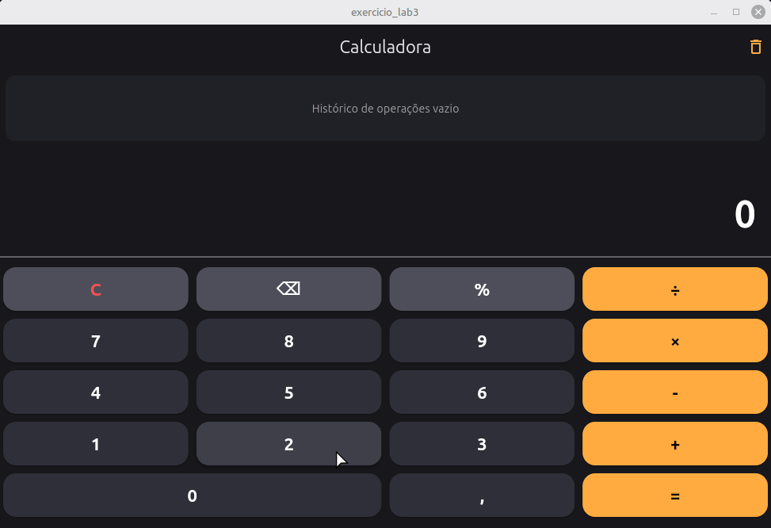

# Calculadora em Flutter

Aplicação de Calculadora interativa desenvolvida em **Flutter e Dart** como solução prática para o **Laboratório 3** da disciplina de Desenvolvimento Mobile do professor **Prof. Mateus de Paula**.

## Funcionalidades
- **Operações Básicas:** Adição (`+`), Subtração (`-`), Multiplicação (`×`) e Divisão (`÷`).
- **Expressão em Tempo Real:** Visualização dinâmica dos números e operadores selecionados no visor durante o cálculo.
- **Painel de Histórico:** Armazenamento automático e rolagem das operações calculadas.
- **Limpeza Rápida:** Botão para resetar o visor (`C`), apagar último dígito (`⌫`), cálculo de porcentagem (`%`) e opção para limpar o histórico.

## Demonstração da Aplicação



## 📌 Execução Nativa (Linux Mint)

Devido às restrições de virtualização (KVM) no emulador Android, a aplicação foi executada utilizando compilação nativa para **Linux Desktop / Web**, garantindo leveza e desempenho imediato.

```bash
flutter run -d linux

CalculadoraApp (MaterialApp - Dark Theme)
  └── CalculadoraScreen (Scaffold)
        ├── AppBar ("Calculadora") -> IconButton (Limpar Histórico)
        └── Column (body)
              ├── Container (Painel de Histórico) -> ListView.builder
              ├── Container (Visor do Resultado & Expressão)
              ├── Divider
              └── Column (Teclado 4x5)
                    ├── Row -> [ C | ⌫ | % | ÷ ]
                    ├── Row -> [ 7 | 8 | 9 | × ]
                    ├── Row -> [ 4 | 5 | 6 | - ]
                    ├── Row -> [ 1 | 2 | 3 | + ]
                    └── Row -> [ 0 | , | = ]